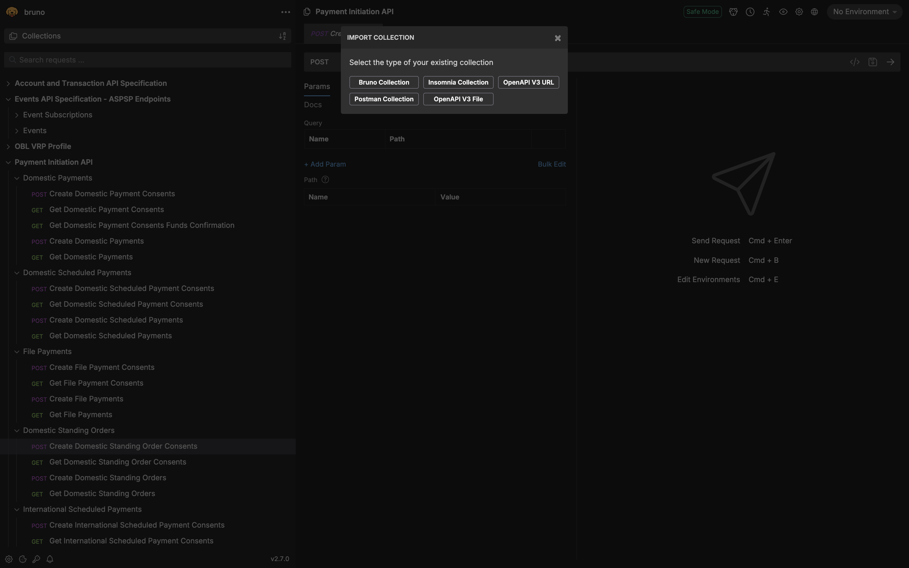
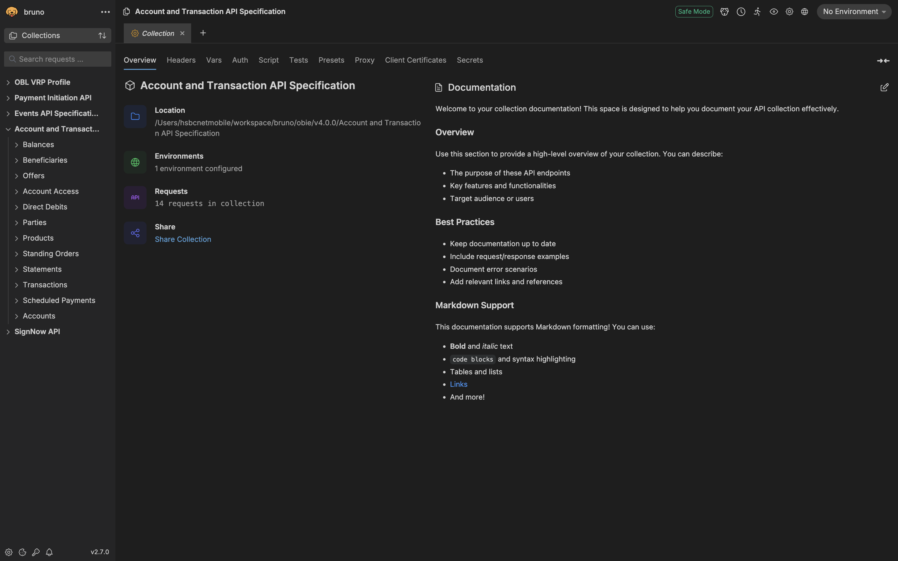
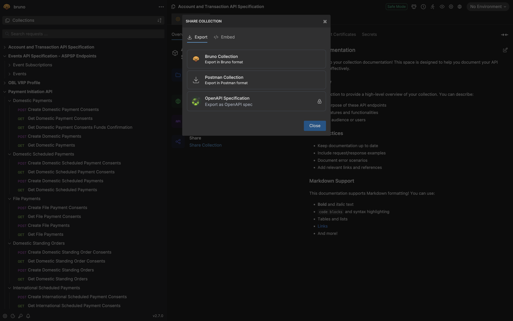
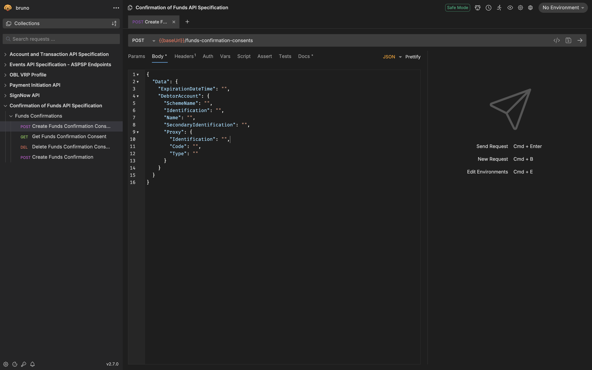
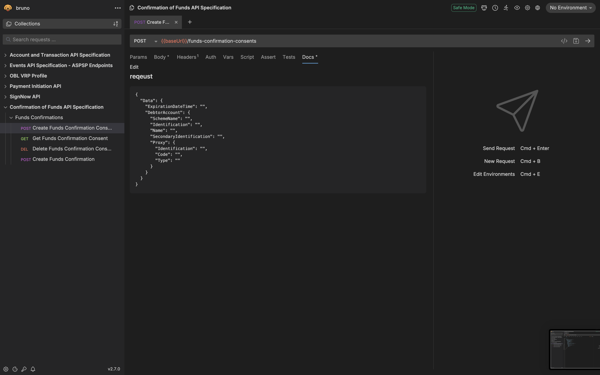

# bruno 

## import collection  

 


## collection 
 


## share collection
 


## request
 

 

## bru  


```
Usage: bru <command> [options]
Commands:
  bru import <type>   Import a collection from other formats
  bru run [paths...]  Run one or more requests/folders
```


## bru import   
```
bru import <type>
Import a collection from other formats
Positionals:
  type  Type of collection to import    [string] [required] [choices: "openapi"]
Options:
      --version          Show version number                           [boolean]
  -h, --help             Show help                                     [boolean]
  -s, --source           Path to the source file or URL      [string] [required]
  -o, --output           Path to the output directory                   [string]
  -f, --output-file      Path to the output JSON file                   [string]
  -n, --collection-name  Name for the imported collection               [string]
      --insecure         Skip SSL certificate verification when fetching from
                         URLs                         [boolean] [default: false]
```

```bash
bru import openapi --source 

-rw-rw-r-- 1 rock rock 1578707 Jul 18 00:28 account-info-collection.json
-rw-rw-r-- 1 rock rock    5733 Jul 18 00:28 event-notifications-collection.json
-rw-rw-r-- 1 rock rock  287610 Jul 18 00:28 events-collection.json
-rw-rw-r-- 1 rock rock 4395213 Jul 18 00:28 payment-initiation-collection.json
-rw-rw-r-- 1 rock rock 1002042 Jul 18 00:28 vrp-collection.json


bru import openapi --source account-info-openapi.yaml --output .
bru import openapi --source confirmation-funds-openapi.yaml --output .
bru import openapi --source event-notifications-openapi.yaml --output .
bru import openapi --source events-openapi.yaml --output .
bru import openapi --source payment-initiation-openapi.yaml --output .
bru import openapi --source vrp-openapi.yaml --output .

```


### bru run 

```
bru run [paths...]

Run one or more requests/folders

Options:
      --version                    Show version number                 [boolean]
  -h, --help                       Show help                           [boolean]
  -r                               Indicates a recursive run
                                                      [boolean] [default: false]
      --cacert                     CA certificate to verify peer against[string]
      --ignore-truststore          The specified custom CA certificate
                                   (--cacert) will be used exclusively and the
                                   default truststore is ignored, if this option
                                   is specified. Evaluated in combination with
                                   "--cacert" only.   [boolean] [default: false]
      --disable-cookies            Automatically save and sent cookies with
                                   requests           [boolean] [default: false]
      --env                        Environment variables                [string]
      --env-file                   Path to environment file (.bru) - can be
                                   absolute or relative path            [string]
      --env-var                    Overwrite a single environment variable,
                                   multiple usages possible             [string]
      --sandbox                    Javascript sandbox to use; available
                                   sandboxes are "developer" (default) or "safe"
                                                 [string] [default: "developer"]
  -o, --output                     Path to write file results to        [string]
  -f, --format                     Format of the file results; available formats
                                   are "json" (default), "junit" or "html"
                                                      [string] [default: "json"]
      --reporter-json              Path to write json file results to   [string]
      --reporter-junit             Path to write junit file results to  [string]
      --reporter-html              Path to write html file results to   [string]
      --insecure                   Allow insecure server connections   [boolean]
      --tests-only                 Only run requests that have a test or active
                                   assertion                           [boolean]
      --bail                       Stop execution after a failure of a request,
                                   test, or assertion                  [boolean]
      --verbose                    Allow verbose output for debugging purposes
                                                                       [boolean]
      --csv-file-path              Path to the CSV file                 [string]
      --json-file-path             Path to the JSON data file           [string]
      --iteration-count            Number of iterations                 [string]
      --reporter-skip-all-headers  Omit headers from the reporter output
                                                      [boolean] [default: false]
      --reporter-skip-headers      Skip specific headers from the reporter
                                   output                  [array] [default: []]
      --client-cert-config         Path to the Client certificate config file
                                   used for securing the connection in the
                                   request                              [string]
      ----noproxy                  Disable all proxy settings (both
                                   collection-defined and system proxies)
                                                      [boolean] [default: false]
      --delay                      Delay between each requests (in miliseconds)
                                                                        [number]
```


```
bru run --insecure --iteration-count 2 --delay 1000 --format html --reporter-html react-native-artifacts.html --verbose 
```


## [bru-lang](https://docs.usebruno.com/bru-lang/overview)  


## [converters](https://docs.usebruno.com/converters/overview)


## [postman-to-bruno](https://docs.usebruno.com/converters/postman-to-bruno)
```javascript
const { postmanToBruno } = require('@usebruno/converters');
const { readFile, writeFile } = require('fs/promises');
 
async function convertPostmanToBruno(inputFile, outputFile) {
  try {
    const inputData = await readFile(inputFile, 'utf8');
    const brunoCollection = postmanToBruno(JSON.parse(inputData));
    await writeFile(outputFile, JSON.stringify(brunoCollection, null, 2));
    console.log('Conversion successful!');
  } catch (error) {
    console.error('Error during conversion:', error);
  }
}
 
// Usage example
convertPostmanToBruno('path/to/postman-collection.json', 'path/to/bruno-collection.json');
```
## [insomnia-to-bruno](https://docs.usebruno.com/converters/insomnia-to-bruno)
```javascript
const { insomniaToBruno } = require('@usebruno/converters');
const { readFile, writeFile } = require('fs/promises');
 
async function convertInsomniaToBruno(inputFile, outputFile) {
  try {
    const inputData = await readFile(inputFile, 'utf8');
    const brunoCollection = insomniaToBruno(JSON.parse(inputData));
    await writeFile(outputFile, JSON.stringify(brunoCollection, null, 2));
    console.log('Insomnia conversion successful!');
  } catch (error) {
    console.error('Error during Insomnia conversion:', error);
  }
}
 
 
convertInsomniaToBruno('path/to/insomnia-collection.json', 'path/to/bruno-collection.json');
```
## [openapi-to-bruno](https://docs.usebruno.com/converters/openapi-to-bruno)    

```javascript
const { openApiToBruno } = require('@usebruno/converters');
const { readFile, writeFile } = require('fs/promises');
 
async function convertOpenApiToBruno(inputFile, outputFile) {
  try {
    
    const jsonContent = await readFile(inputFile, 'utf8');
    
    const openApiSpec = JSON.parse(jsonContent);
    
    const brunoCollection = openApiToBruno(openApiSpec);
    
    await writeFile(outputFile, JSON.stringify(brunoCollection, null, 2));
    console.log('OpenAPI JSON conversion successful!');
  } catch (error) {
    console.error('Error during OpenAPI JSON conversion:', error);
  }
}
 
 
convertOpenApiToBruno('path/to/openapi-spec.json', 'path/to/bruno-collection.json');
```